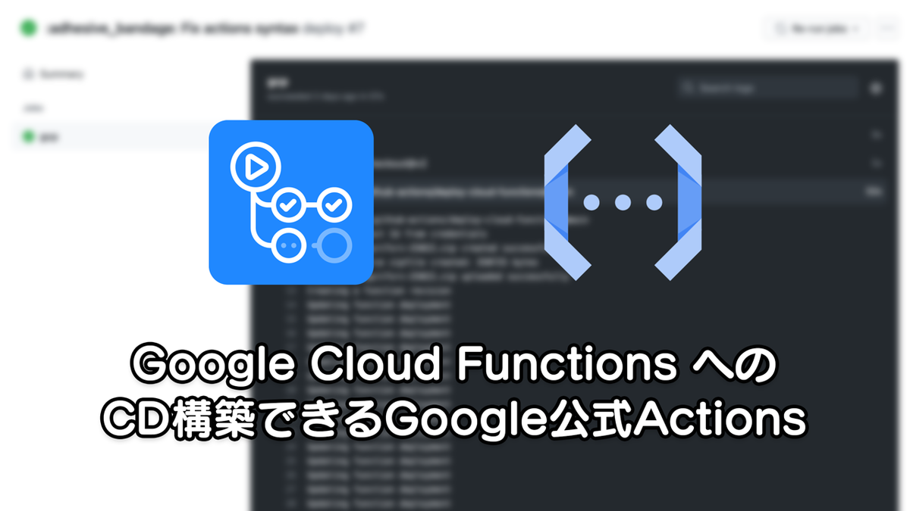
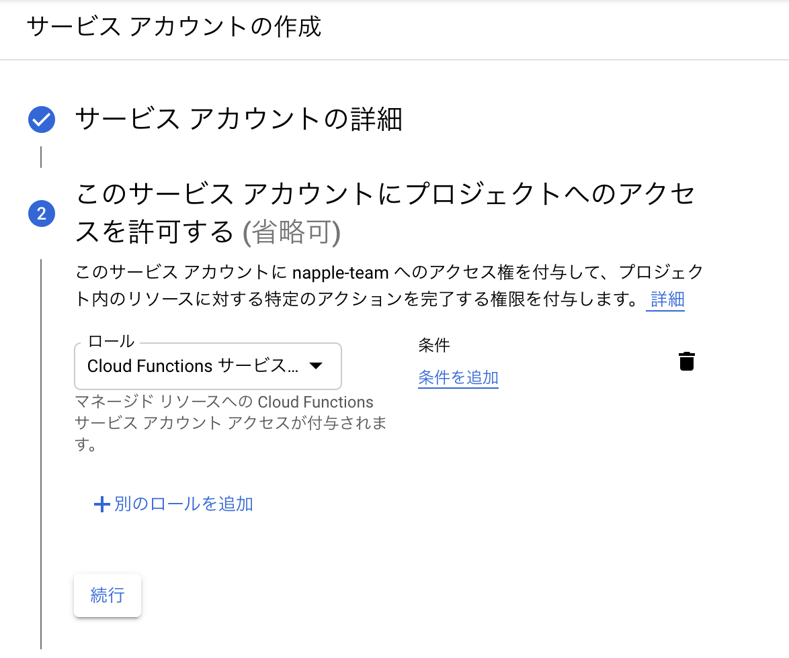
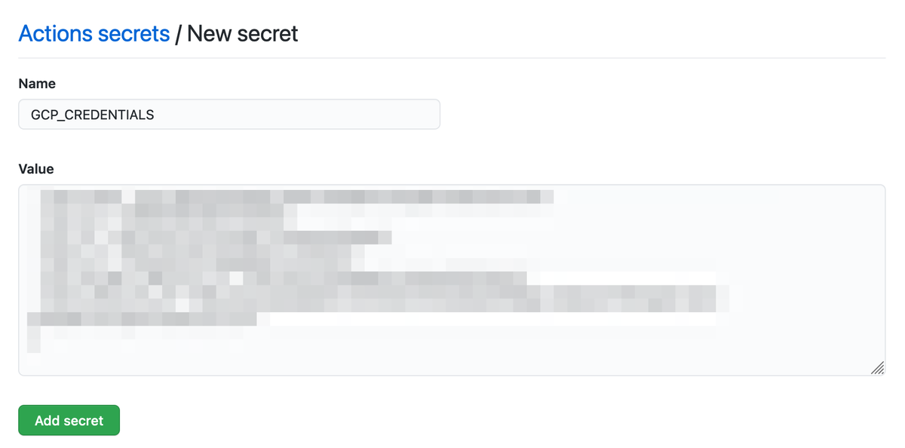
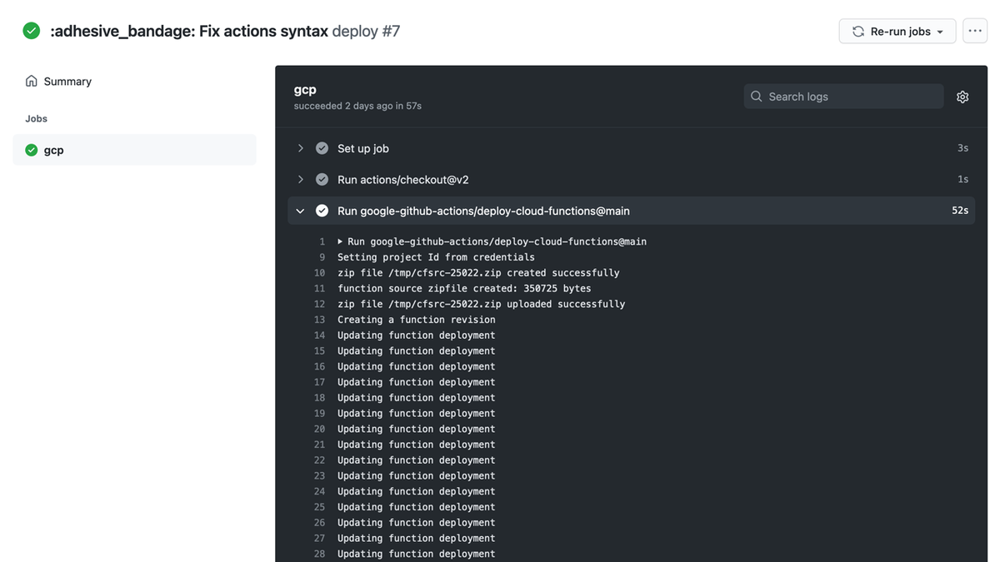

Google Cloud Functions ってやつ、 Slack の Webhook 系のアクションだとか、情報を整形して別の API に横流しするだけの Proxy 系アプリケーションなんかのホスト先として便利に使ってたのだけども、その簡単さからCDの構築をサボっていて、よくリポジトリの状態と実際に展開されているコードが違うみたいな状態のまま放置してしまうなどどうにもうまく管理ができていなかったんですよね。まあ先述の通りそんなに重要なアプリケーションを管理しているわけでもないので、長らく自分の中での「動いてるからいいや」の代表的な存在だったのですが、やっぱりCVEなんかで報告されているような脆弱性を抱えるライブラリをそのまま放置するのはよくないなという気持ちになり、重い腰を上げてCD環境を整備することにしたのでそのメモ。

### お誂え向き

もともとソースコード管理のメインは GitHub のリポジトリで、そのリポジトリを GCP の Cloud Source Repository にミラーリングし Cloud Functions にポチポチしてデプロイするみたいなフローだったのだけども、いつからか Cloud Source Repository に自動で反映されなくなってしまい（調べてないがおそらく Webhook の設定がおかしいのだと思う）、直せばいいのだけど「面倒だな」と思って放置した結果、「面倒だな」の連鎖が発生してやる気を完全に削ぐ原因になっていた。で、「じゃあ GitHub Actions から直接 Cloud Functions にデプロイできねえのか」と思って探したらすんなり見つかったんだよね。さすが2021年。

[google-github-actions/deploy-cloud-functions: A GitHub Action that deploys source code to Google Cloud Functions.](https://github.com/google-github-actions/deploy-cloud-functions)

「え〜 めちゃくちゃ便利じゃん〜」と思って早速使おうと思ったのだけど、なぜかリポジトリの Star が2021年3月時点で30個ぐらいしかついてなくて、 Organization の名前に「google」って入ってるけど非公式なの？と思って調べたのだけど、 People 欄に表示されている人が Google の公式 Organization にも所属しているのでおそらく大丈夫なのだろうと（本当に最近できた Org なのだと思う）。そんなわけで実際に使ってみることにしたわけ。

### サービスアカウントを作る

Actions を実行するためには当然だが Cloud Functions にデプロイするためのサービスアカウントのキーが必要になる。GCPのアカウント権限周りの設定は毎度わからんという気持ちになるがこのような愚痴はグッと飲み込んで、プロジェクトの「IAM と管理」→「サービスアカウント」の画面から `cloudfunctions.serviceAgent` (Cloud Functions サービスエージェント) 権限を持つアカウントを作成してやる。その他の「条件」は必要であれば入れる。鍵が流出したときのリスクとかを制御できるのでそう考えると入れたほうがよいのは当然なのだが、使い回すにはいちいちアカウントつくったりしなきゃならんので個人管理のものであると面倒である。



そのままサービスアカウントのキーも作成してしまい、発行された JSON キーをそのまま GitHub リポジトリの Settings → Secrets へ登録するとよい。



### Actions のジョブにデプロイするステップを追加する

このとき設定できる内容については [google-github-actions/deploy-cloud-functions](https://github.com/google-github-actions/deploy-cloud-functions) の README を見れば全て書いてくれている。注意したい点としては環境変数を与えているのであればここで指定しておく必要があるということ。

```yml
- id: deploy
  uses: google-github-actions/deploy-cloud-functions@main
  with:
    name: clound-functions-application
    runtime: nodejs12
    entry_point: application
    credentials: ${{ secrets.GCP_CREDENTIALS }}
    env_vars: >-
      SECRETS_ENVIRONMENT_1=${{ secrets.SECRETS_ENVIRONMENT_1 }}
      ,SECRETS_ENVIRONMENT_2=${{ secrets.SECRETS_ENVIRONMENT_2 }}
```

たいてい秘匿情報とかがあるので Actions 側の Secrets に登録する羽目になる。複数ある場合なんかはカンマで繋げる必要があるが YAML のヒアドキュメントである `>-` なんかを組み合わせて使うと改行できて便利。

### 実際に動かしてみる

実際に Actions を動かしてみると、おお動くという感じになると思う。デプロイにはすこしだけ時間がかかるものの、 Actions 側はデプロイしたアプリケーションが適用されたことを確認できるまでポーリングするので Actions が終了したらデプロイが完了したものと思えば良さそう。



これで GitHub のリポジトリが Google にミラーリングされているかどうかを気にしたり、デプロイのためのポチポチ業から開放されたわけだ。便利。
