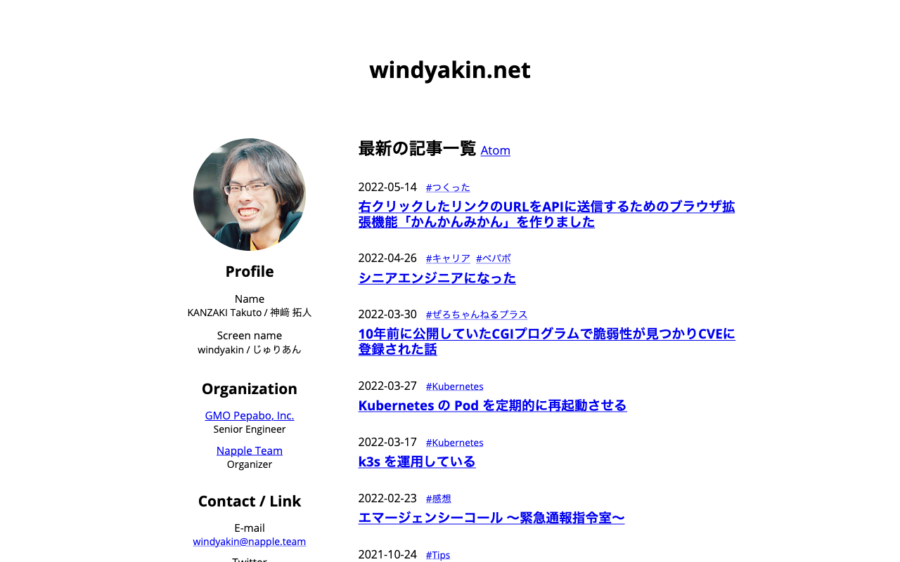

前々から自分のウェブサイトを作り直したいと思っていたのだが（n回目）、正月休みに特段やることがなかったのでようやく手を付けることにした。

### シンプルすぎやしないか

これまで、人よりかは様々なウェブサイトを作った経験があると自負しているが、それによって得られた知見としては、ぬるぬると動くサイトは格好がいいのだが、その後の維持管理にかかるコストがでかすぎて手に負えなくなるということである。そこで、そういったコストをかけたくない自分のサイトにおいては、「とにかくシンプル」に「伝えたいことを伝えられるだけのサイト」となるようにした。

具体的に目指したのは「CSS が欠損しても最悪どうにかなる DOM 構造にする」で、結果として CSS 装飾ほぼなし・ JavaScript は一切なしという、[阿部寛のホームページ](http://abehiroshi.la.coocan.jp/)もびっくりな過激サイトが完成してしまったのである。

ブログについても、これまで はてなブログ を使っていたのだが、自身のコンテンツを第三者が左右できる状態にあるという状態がどうも落ち着かないので、これを機にサイトと統合することにした。直近公開していたいくつかの記事については、新しいサイトにもアーカイブとしてコピーしてきたが、既にはてなブログ側で公開している記事については、各所からハイパーリンクで参照されている可能性もあるので、デッドリンクとしないために残しておくことにする（今後ははてなブログを更新をしないつもりでいる）。

### Eleventy を使った

ちなみに今回のリニューアルに際して、使用することとしたサイトジェネレータは、昨今話題の [Eleventy](https://www.11ty.dev/) である。冒頭に書いたこのサイトのコンセプトがあるため、テンプレートをイチから自身で書くことになったが、初めて触った割にはすんなり動かすことができて概ね満足である。

リポジトリについては以下の通り。

[windyakin/windyakin: windyakin's profile and portfolio](https://github.com/windyakin/windyakin)

### 今後について

ウェブサイトの構成はまだ詰めきれていないのだが、<q>完璧を目指すよりまず終わらせろ</q>ということで、公開してから調整することにする。

あとコンテンツについてももう少し拡充するつもりである。以前から温めている職務経歴書が公開できるとよいのだが。
