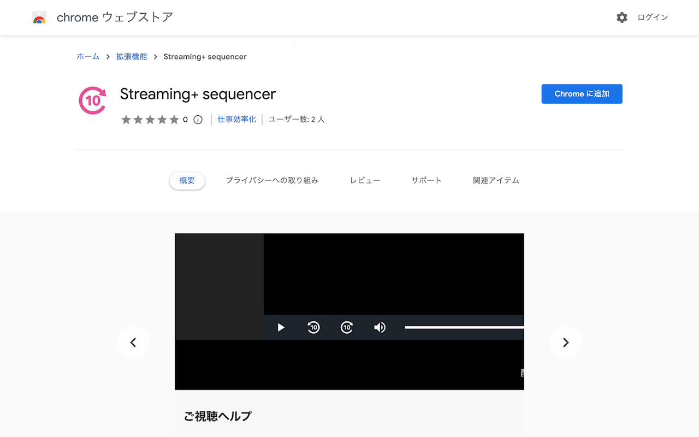
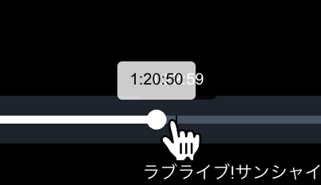
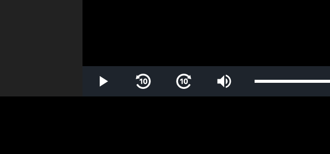

### Streaming+ の操作がしづらいという問題

eplus のライブ動画配信サービス Streaming+ というものがある。アーティストのライブを有料でオンライン配信する際に利用されるプラットフォームなのだが、一定期間アーカイブ視聴できる機能があって、自分もよく利用している。

ただこのサービス、配信の動画品質や転送速度には不満は無いのだが、画面上での動画の操作が非常にしづらいという欠点がある。例えば、「あ、今のシーンよかったな。もう一度みたいな」と思う場面があったときに、時間を操作するための UI がシーケンスバーしかなく、その上動画の長さが3時間とかあるため、細かい操作ができずにイライラさせられることが多かった。

### この問題を解決するためのブラウザ拡張機能を作った

毎回ライブ動画を視聴する度に、このことを不満を感じていたのと、 [Twitter でも同じような悩みを持つ人を観測した](https://twitter.com/yamakawasui/status/1624665559383306241)ので、問題を解決するため、 "Streaming+ sequencer" というブラウザ拡張機能を作った。

* [Streaming+ sequencer - Chrome ウェブストア](https://chrome.google.com/webstore/detail/-/kfcdfgmgegbdhbhlaplbkalkelalkjcl?hl=ja)
* [Streaming+ sequencer – 🦊 Firefox (ja) 向け拡張機能を入手](https://addons.mozilla.org/ja/firefox/addon/streaming-sequencer/)

この拡張機能は、 Steraming+ で再生中の動画に表示されるコントローラの部分に、動画の再生位置を10秒スキップ・10秒巻き戻すためのボタンを追加してくれるものである。

押すと実際に10秒行ったり戻ったりの操作が行われるのだが、実際に自分で使っていても当初の目的を達成できて、非常に便利なので満足している。というか eplus が利用している Video.js のプラグインを入れて機能として提供してくれれば、こんなまどろっこしいことをしなくて済んだのだけども。

### 機能実装の方法について

ちなみに、実現方法としてはごくシンプルに [HTMLVideoElement](https://developer.mozilla.org/ja/docs/Web/API/HTMLVideoElement) の API を使っているだけである。拡張機能側は `live.eplus.jp` というドメインにアクセスすると、必要な JavaScript と CSS を流し込むだけで、特に環境を汚したりとか、 eplus 側に負荷をかけて迷惑がかかるということもないだろう。

実装コードは GitHub にも公開しているので、どういった実装になっているか気になる人は見てもらうこともできる。

* [windyakin/streaming-plus-sequencer](https://github.com/windyakin/streaming-plus-sequencer)

ただ今後の課題としては、配信画面の実装が変わったときにデバッグするのが困難なことであろうか。まさに「ペイウォール」に阻まれているので、動かなくなった報告を受けても自分で確認するのはなかなか難しいものがあるなと感じている。
