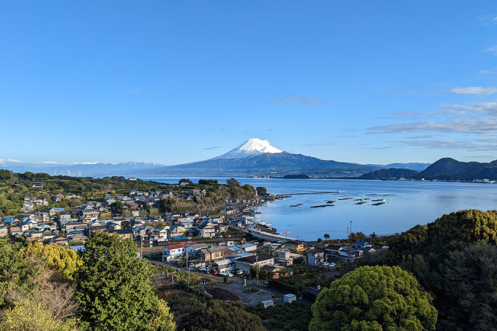
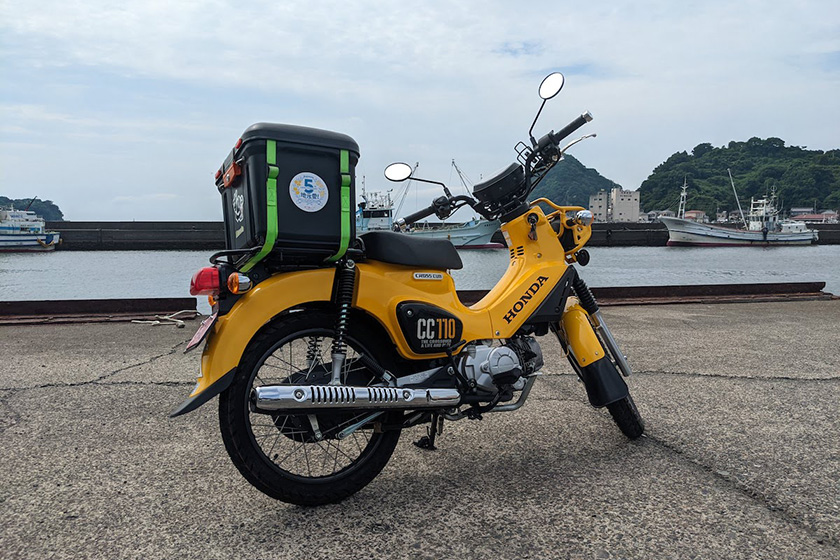
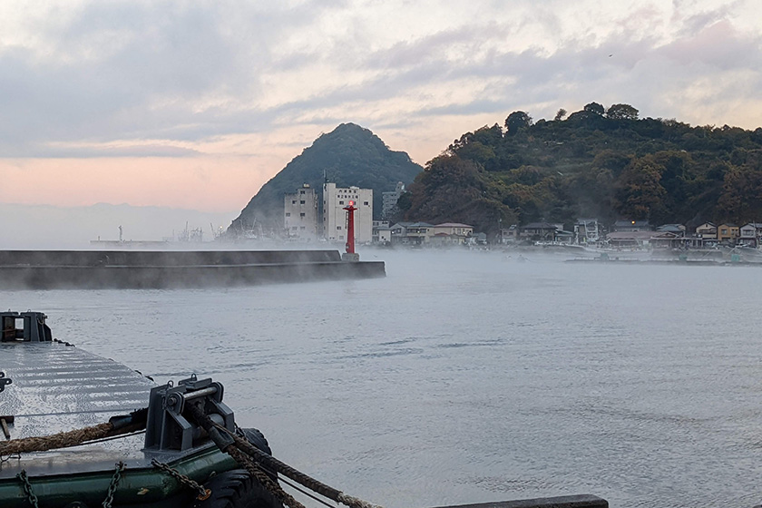
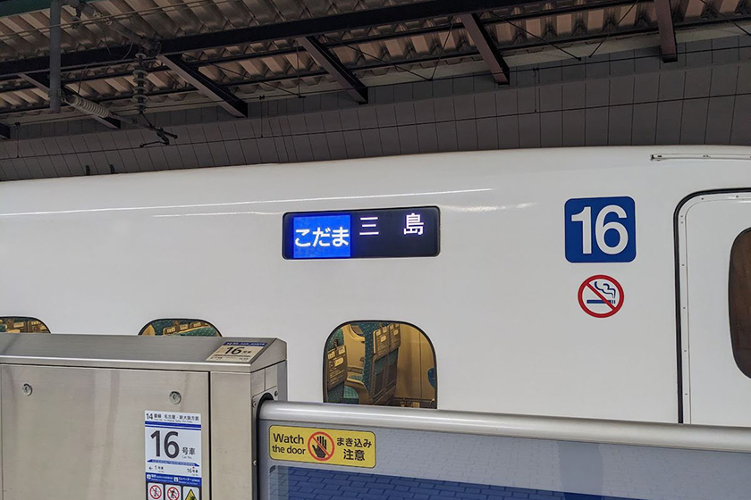
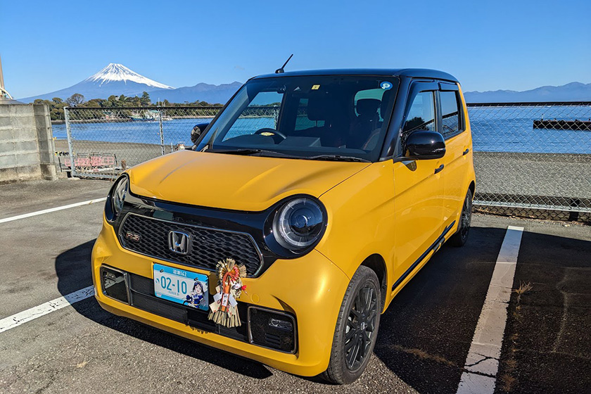
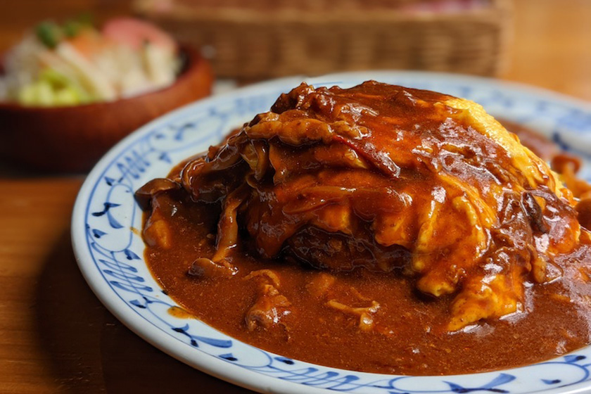
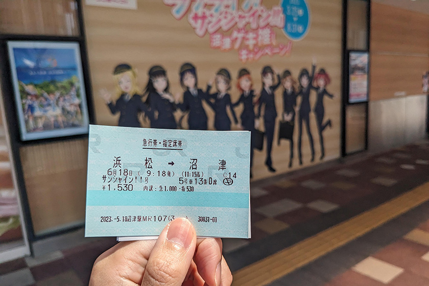
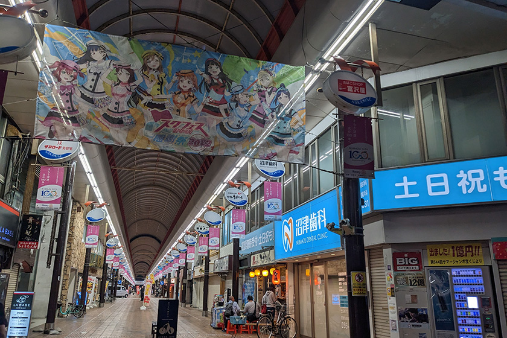
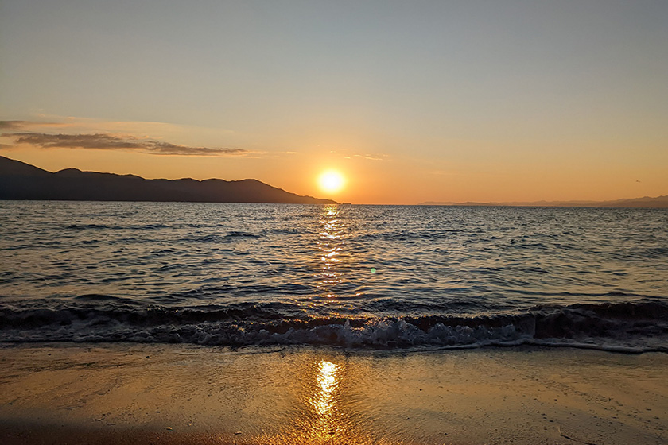

私が沼津市役所で転入届を出して沼津市民となったのは [Aqours の結成日である6月30日](https://twitter.com/MITLicense/status/1277786317896642561)。その年は5周年だったAqoursが、今年8周年を迎えるということは、わたしの沼津市民生活も3年目を終えたということだ。

ちょうどいい機会なのでここまでの3年間を振り返ってみて、自身にどういう変化があったかについて雑に書いていこうと思う。

### バイクを買った

地方都市の問題として乗り物が無いと困ることが多いというのがある。住んでる場所次第では最悪無くても生きていけるのだが、気軽に買い物や内浦に行ったりしたいのであれば、あった方が好ましい。

とはいえいきなり車を買う勇気はなかったことと、実家でリトルカブを乗り回していたこともあって、これを機会にバイクを購入することにした。ただそこそこ交通量のある沼津で 50cc は大変だと思い、ある程度の排気量のバイクに乗るために、免許の取得からすることにした。

フレックスタイムや半休などを駆使して無理やりねじ込み、1ヶ月半ぐらい自動車学校に通って、中型二輪免許を取得した。免許自体は 400cc まで乗れることになっている。

購入するバイクは [ホンダ クロスカブ110](https://www.honda.co.jp/CROSSCUB/) にした。信頼と実績のスーパーカブの兄弟車で、工事車両みたいなイエローとブラックで配色された見た目のかわいさと、税金の手頃さなどから 110cc のバイクを選んだ。クロスカブは今となっては人気車種で半年から1年待ちなんて言われているが、当時はまだ人気が出始めたぐらいの頃で、近所のバイク屋さんで注文して1ヶ月もしないぐらいで納車されたので、本当にタイミングが良かった。

125cc 以下のバイクは自動車専用道や高速道路には乗れないが、下道では一番小回りとスピードが両立できるサイズである。見知らぬ細い道に入って行っても怖くないし、大きい道でも周りの車と同じ速度で走ることができる。

### 自然現象に関心を持つようになった

沼津は海と山の両方を楽しめる自然に囲まれた地だ。季節ならではの自然現象も多く、沼津では「しおくずばんば」と呼ばれる海霧や、水平線に沈む夕日が蜃気楼のようになって見える「だるま夕日」、夏の訪れを告げる「夜光虫」など、見所は枚挙にいとまがない。

そしてやはり沼津にとって富士山は欠かせない。子供の頃から沼津に住んでいる人が言っていた「富士山はいつ見ても飽きない」と言っていたのは本当にそうだなと思う。案外毎日少しづつ違いがあったりするもので、冠雪が増えた・減ったとか、空気が綺麗だとよく見えたり、雲のかかり方ひとつとっても季節性があったりするので面白いのだ。

東京に住んでいた頃は気温や雨が降るのかぐらいしか気にしたことがなかったが、沼津に来てからは自然を感じるシーンは格段に多くなった。

### 新幹線で通勤するようになった

現職は現状フルリモートをやっていないので、週に1回ぐらいオフィスへ出社することがある。沼津からの通勤には新幹線を使っている。実は三島・沼津エリアから東京への通勤というのはあまり珍しいものではない。というのも三島駅に新幹線の車庫があり、朝・晩の時間帯だけ車庫に出し入れする列車を営業列車にした三島発着のこだま号が結構な頻度で運行されているため、昔から三島から東京の会社に通っているという人は少なくないのだ。

三島・沼津間の列車は新幹線に合わせてダイヤが組まれているので乗り継ぎもよく、片道2時間ぐらいあれば通勤が可能できる。遠いは遠いが、こだま号の自由席はほぼ確実に座れるので、首都圏の通勤列車の硬いロングシートでの移動に比べれば楽な方かもしれないなと思っている。

### 自動車を買った

バイクを買って1年後、車を買った。最初こそバイクだけで十分じゃん〜とか思っていたのだが、冬のバイクの過酷さを完全に舐めていた。とはいえ、沼津は冬も比較的温暖な地方だし、雪の心配をすることもないので、乗ろうと思えば乗れるのだけども、寒いもんは寒い。

買ったのは [Honda N-ONE RS](https://www.honda.co.jp/N-ONE/) のマニュアル車である。「なぜマニュアルを」とよく聞かれるが、よくある「人生で一度ぐらいはマニュアル車に乗りたい」という思いからである。最初は軽トラも候補にあったのだが、普段遣いのことを考えて乗用車となった。

初の新車購入の車なので大事に乗っている。とはいえ通勤には使わないし、もともとバイクもあるので、あまり動かさない週もあるのだが、雨の日の移動や、ライブ会場の遠征などに使えるので非常に便利である。バッテリーさえ持っていけばワークスペースとしても機能させることができて便利である。

### 馴染みの店ができた

これまであまり決まった店に行くということがなかった。外食という選択があまり自分の中で優先度が低く、行ってもチェーン店とか、そういったところで済ませる事が多いのが実情だった。また、個人店となると（勝手に）入りづらいと思ってしまい、あまり進んで行く感じでもないタイプである。

沼津は聖地巡礼者向けに Twitter をやっている店が多いため、事前に店の雰囲気を知ることができる。よく行っている「[ねこと白鳥](https://www.nekohaku.com/)」というバーは、 Twitter で存在を知った店の一つである。そもそもそれまでバーというものに縁遠かったのだが、 Twitter で雰囲気を知ったり、聖地巡礼で訪れた観光客を拒まない雰囲気が良いなと思い、初めて入店したのは私が移住する前の出来事である。それ以降、沼津に行くと訪れることも多かったのだが、移住をきっかけに頻度が上がり、今ではほぼ毎週通うぐらいになった。

また、市場町にある マリー・ルゥ という喫茶店は、移住してから散歩しているときに知ったお店である。少し大通りから離れたそのお店の雰囲気は、昭和〜平成初期のままで、2023年の今でもランチはサラダ・ドリンク付きで800円という良心的な価格で提供しており、個人的に応援しているお店だ。

木曜日にランチメニューで出るオムライスが気に入ったので、毎週食べに行っていたら、どうやら「オムライスの人」として認知されたらしい。店主の人も気さくに話しかけてくれるので、仲良くしていただいている。

### ラブライブ！サンシャイン!! の勢いがとどまることを知らない

沼津という土地で避けて通れないのが ラブライブ！サンシャイン!! である。自分自身ラブライブ！で沼津という街を初めて知った身である。そこから沼津そのものが好きになり移住までしたというのは、移住者にはよくある話である。

自分が入植した2020年は、アニメも劇場版まで終わって一段落し、ラブライブ！シリーズでも新しいグループが出てきたので、もうこれ以上はないのではという雰囲気だった。そこで自分は勝手に「これから下火になっていくかもしれない沼津を見届けるんだ！」という気持ちだったのだが、その予想は外れることになる。なんと2023年になっても、新たにJR東海とコラボをして駅の装飾が増えたり、また新しくスピンオフアニメが始まったりと、8年目の今日も勢いが増していくばかりなのだ。

まだまだ何が起こるかわからない沼津の変化は、これからも自分を驚かせてくれるだろうと思っている。

### 良いことばっかり言っているがデメリットはないのか

個人的な話として田舎で生まれ育ったというのもあり、自分には都会での生活はどうしても馴染めなかったという過去がある。沼津での生活は東京に比べて居心地が非常にいいと思っている。

ただ都会の生活に慣れている人からすると、おそらく信じられないぐらい娯楽がないと思うだろう。イベントや演劇といったものは都会でしか行われないことが多い。まあただ沼津は時間とお金さえあれば、在来線でも東京に行けるぐらいの距離にあるので、東京のイベントに行こうと思えばいけなくはない。気軽さは減るだろうが。

他にも沼津には映画館やショッピングモールはあるものの、それ以外の遊び場は本当に限られる。自分はただバイクで走って季節を感じるだけでも楽しめる人間なので、娯楽施設は必要としていないのだが、刺激的なことがしたいとか、新しいことをやりたい！みたいなキラキラした人には向いてないのが事実である。

### 4年目にやっていきたいこと

沼津生活もついに4年目になり、自分的には非常に満足度が高い日々を送っている。一方で自分自身が他者とのつながりや地域コミュニティへの参加という部分が希薄という部分に問題を感じている。

沼津に住んでいる移住者の知り合いは少なく、ここ最近ようやく増えて何人かと仲良くさせてもらっている。しかし同じように沼津に移住したという人はもっと多いはずなのに、その実態は殆ど見たことがない。 Twitter を見ていると、それぞれ小さなつながりはあれど、横のつながりがないというのが現状のようだ。

自分はこれを少しでも解決できないかと思っている。中には何かに困っていたりして、コミュニティがあれば参加したいという人も少なくはないはずだ。同じ理由で同じ場所に移住してきた者同士で、相談や情報交換とかができるような場所を作れないかと思っていて、今まさに活動している真っ最中である。

実現にはまだ道半ばだし、もしかしたらうまくできないかもしれないが、できることから頑張っていこうかなと思う。

### さいごに

「お前がそこまで推す沼津に興味がある」、「行ってみたい」などがあれば、沼津旅行のご案内や、旅程のコーディネートだけでも相談に乗ります。すでに何名かの方にはご案内し、ご満足していただいた実績もありますので、ぜひ気軽にお声がけください。

それではまた沼津でお会いしましょう。
