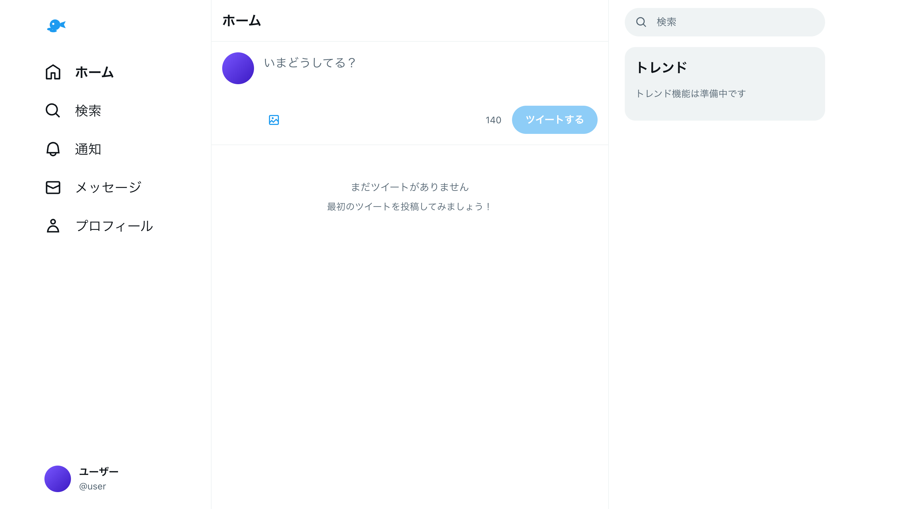

Twitter (X) をしてたときに、何が一番気になっていたかって考えると、やっぱり通知欄だった気がするんですよね。特に用事もないのに無限に開いては更新していた気がする。

だから、ツイートしてそれに通知が来さえすりゃいいんじゃないかと。そこに必ずしも他者という人間が介在する必要があるかというと、必ずしもそうではないのではないかと。知らん誰かなんてNPCみたいなもんじゃないですか。あくまで「数字」として受け取っているもののほうが多かったような気がするわけです。個人的には。

なのでそれだけを取り出したものを作ってみました。

[https://modoki.windyakin.net/](https://modoki.windyakin.net/)

### 何ができるのか

ツイートの投稿ができます。投稿したツイートはインターネットには送られず、内容はブラウザ内の [localStorage](https://developer.mozilla.org/ja/docs/Web/API/Window/localStorage) と [IndexedDB](https://developer.mozilla.org/ja/docs/Web/API/Window/indexedDB) に保存されるようになっています。

投稿したポストには、定期的に誰かからのリアクションが自動でつくようになっています。頻度は適当ですが、一応設定から比重を選べるようにはなっています。

リアクションがつくと通知欄にバッジがついて、数字が増えるようになっています。開くと既読になって消える。

主だった機能はそれだけです。

個人的には、先述の通り、通知が来ることと、その通知の数字を消すこと無意識に繰り返していた節があり、実際使ってみていると、全然これだけで何十分と時間を消費できてしまうんですよね。

なのでこの通知欄の数字こそが「報酬系を刺激する部分」だったのだろうと思っています。もちろん人それぞれだとは思いますが。

### Claude Code

コードはほとんど Claude Code に書いてもらいました。人間が介在したのは機能の提案とコンポーネントの設計がよくないときにそれを指摘するぐらい。

現状、コンポーネントで共通化させるには人間が言わないとしてくれない感じがします。ただ共通化したいのは人間の認知範囲に限界があるからというのが主だった理由で、コーディングエージェントだけが稼働している世界になったとき、彼らにとってはあんまり気にすることでもないのかもしれません。

各アイコンとかの SVG は Claude Code が勝手に作り出したんですが、あまりにもそのまんますぎるのも扱いに困りますね。

ロゴアイコンは最初本当にそのままの鳥が出てきたので、「オマージュ的なものにして」と指示を出したところ現状のものになりました。一応下側のふたつの円が胴体と羽と言い張ってるんですが、全然そうには見えません。溶けてる鳥かな？

### この先

すぐ思いつくのは、タイムラインに LLM による他者を介在させたいというところですよね。何人かにこのツール見せたとき、だいたいそういう提案をもらいました。

ただ現状の「バックエンドが介在しない」というのがこのツールの利点でもあるので、あんまり実装に乗り気ではないです。 [Chrome がブラウザから JavaScript で LLM を呼び出す API を実験機能として出している](https://developer.chrome.com/docs/ai/built-in?hl=ja)っぽいので、そういうので解決できればいいですよね。

### 結論

インターネットをやめたい人におすすめです。
