### バスを借りて会場入りした

")

6月21日・22日に埼玉県のベルーナドームを会場に行われた、 [Aqours Finale LoveLive! 〜永久stage〜](https://www.lovelive-anime.jp/uranohoshi/live/live_detail.php?p=Aqours_Finale) の開催に合わせ、沼津から会場まで直行する貸切バスの運行を、 [沼津移住者コミュニティ うみねこ](https://umineco.org) の主催として行った。

概要についてはうみねこのウェブサイトにも掲載しているので、そちらを見てほしい。

- [ラブライブ！サンシャイン!!ラッピングバスを貸し切ってAqoursのFinaleライブ会場に向かいました](https://umineco.org/news/20250621/aqours_finale_lovelive_charter_bus)

本記事では、今回のバスの貸し切り運行に関する紆余曲折と、今後同じことをやる人が居たときのためになんとなくの知見を共有する。

### 会場入りできるバスを探せ

ライブの開催については1年ほど前から告知されていたことや、[日程・場所の公開も去年の11月には発表されていたこと](https://x.com/LoveLive_staff/status/1859201909791617359)もあり、昨年の12月には「Aqours のラッピングバスを借りて会場入りできないか」という模索が始まっていた。

うみねこのメンバーの中に、過去に伊豆箱根鉄道の HAPPY PARTY TRAIN 仕様の列車を貸し切り運行した経歴を持つ人がおり、その人が中心となって進めることになった。

「ラッピングバス」と一言で言っても、実は様々な種類が存在する。沼津駅や市内でよく見かけるのは、東海バスや伊豆箱根バスのいわゆる「路線バス」だが、路線バスは一般道での走行を前提として作られており、乗客用の座席にシートベルトなどが装備されていないため、貸し切ることができたとしても、それで会場まで向かうことは難しい。

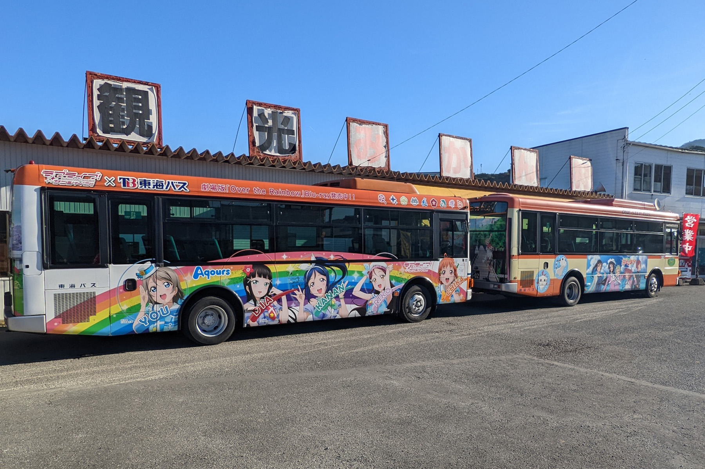

しかしながら、東海バス・富士急シティバスには、高速バスに Aqours ラッピングを施したものが存在する。

* [ラブライブ！サンシャイン!!ラッピングバス4号車 - アニメコラボラッピングバス - 東海バス](https://www.tokaibus.jp/Wrapping_bus_anime/lovelive_wrapping_bus_4.html)
* [富士急シティバス、人気アニメ「ラブライブ！サンシャイン!!」ラッピングバス運行開始 - 観光経済新聞](https://www.kankokeizai.com/%E5%AF%8C%E5%A3%AB%E6%80%A5%E3%82%B7%E3%83%86%E3%82%A3%E3%83%90%E3%82%B9%E3%80%81%E4%BA%BA%E6%B0%97%E3%82%A2%E3%83%8B%E3%83%A1%E3%80%8C%E3%83%A9%E3%83%96%E3%83%A9%E3%82%A4%E3%83%96%EF%BC%81%E3%82%B5/)

東海バスが所有しているラッピング高速バスは、普段バスタ新宿に乗り入れる路線に現役で供用されている。 Brightest Melody の衣装の9人と共に、「Aqoursは沼津にいます」というメッセージ性の強いバスだ。

富士急シティバスについては、2018年頃投入された車体で、かつて東京駅から沼津に直通する高速バス路線で使われていたのだが、コロナ禍以降その路線は休止状態となっており、最近では会社の通勤用送迎バスや、三島駅から河口湖を結ぶ路線に投入されている姿をよく目撃されている。

この2つの編成のどちらかが使えれば嬉しいのだが、一方で西武ライオンズの球場に西武グループの伊豆箱根の通常の観光バスで向かうのも、「浦の星女学院のPTAによる団体旅行」っぽくて味があるなということで、とにかく12月中には沼津でバスを運行している3社（東海バス・伊豆箱根バス・富士急シティバス）にコンタクトを取り、見積もりなどを集めることになった。

### 運行ルートと駐車場

運行ルートについては、距離はそこまでではないものの、「往復するかどうか」の問題があった。往復する場合については、まず帰りのバスが出発できる時間がいつになるのかが読めないという、この会場特有の問題があった。帰りに鉄道を使わない場合でも、基本的に規制退場による誘導がなされるので、終わる時間がなんとなくわかったとしても、なかなか「この時間までに集合」というのは難しい。

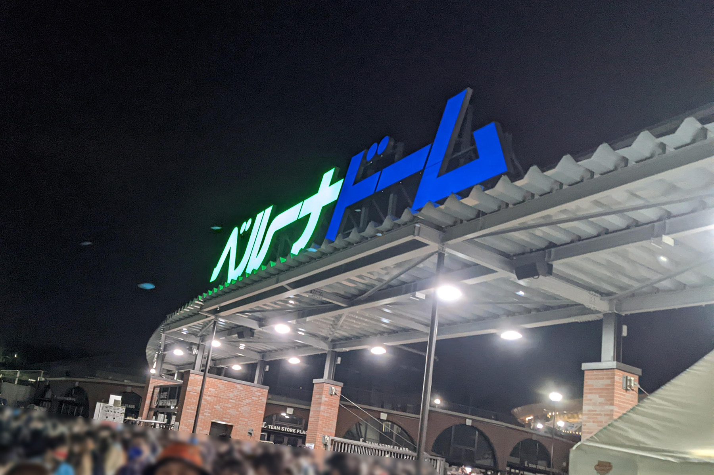

また、ライブ中は乗務員を待機させることになるため、拘束時間が長くなること。そのために交代用の追加の乗務員が必要になること。沼津に到着する頃には日付を回ることから深夜労働手当などの割増料金が発生し、一人当たりの負担額もそれなりになってしまうことなど、様々な理由から復路についての運行は早々に諦めることとなった。

あと、諦めた理由のもう一つがバスの駐車場の問題である。ベルーナドーム周辺にはバスが停められるような場所はなく、基本的に各社とも運行を依頼する我々が駐車場を用意する必要があった。ただ唯一、西武傘下の伊豆箱根バスは駐車場を自身で確保してくれそうな返答に見えたのだが、それがグループの成せる技なのか、そもそも伝え忘れていただけなのか、真偽は不明である。

まあ、そもそも 2 DAYS 開催のライブなので、往復しても乗らない人も多いだろうということで、本運行の経路は往路（沼津→ベルーナドーム）のみ絞ることとなった。

### 富士急トラベルとの面談

問い合わせの結果、東海バスについては、貸し切りバスの運行はできるものの、ラッピング仕様車については、通常の運行路線への充当があるので難しいという回答であった。一方で富士急トラベル（富士急の旅行代理店）からは、二つ返事でOKという回答とともに見積もりが届いた。貸し切り運行の実績はあったのはなんとなく知ってはいたが、こうもあっさりできるとは。やってみるものである。

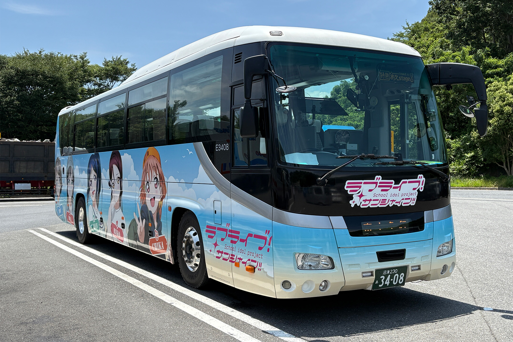

経路を往路だけにしたことで、拘束時間も減り、ある程度の人数を集めさえすれば現実的な見積もりが返ってきたこともあり、富士急さんにお願いすることにした。

富士急でのバスの貸し切りは当団体としては初めて（というか私の人生としても初）だったので、挨拶も兼ねて直接オフィスに伺って担当の方と打ち合わせをした。担当してくださった方も、オタクの我々に優しいと言うか、移住者についても興味を持って聞いてくれるなどし、お互いに「それではよろしくお願いします」ということで、運行が決定した。

### 運行にあたっての募集

一般に、団体旅行における募集というのは「[旅行業法](https://laws.e-gov.go.jp/law/327AC0100000239)」によって、広く一般に募集をかけるためには、[所定の管轄に登録が必要](https://www.mlit.go.jp/kankocho/seisaku_seido/ryokogyoho/ryokogyohogaiyo.html)であり、登録がない個人や団体が勝手にSNS上で募集を行うことはできない。

そのため、本貸し切り運行については「知り合い同士の団体旅行」、いわば自治会などで行われる団体旅行みたいなものという扱いにする必要があるため、運営スタッフの知り合いへ声をかけるのみに制限した。事前のSNSへの投稿も厳しく制限し、法への抵触や、当日の混乱を避けることにはとにかく気を使う必要があった。

結果、20名程度が集まり、まあ負担額も普通に電車で行くよりは高くなるものの、価値のある体験を得たいという人が集まったのはよかった。

### 沼津のめぐみ！いろどり弁当

今回、バスの運行は12時を回ることから、桃中軒が販売している「[沼津のめぐみ！いろどり弁当](https://tochuken.jugem.jp/?eid=391)」を買って車内で食べることにした。というか駅弁ですらラブライブ！コラボがある当地よ。

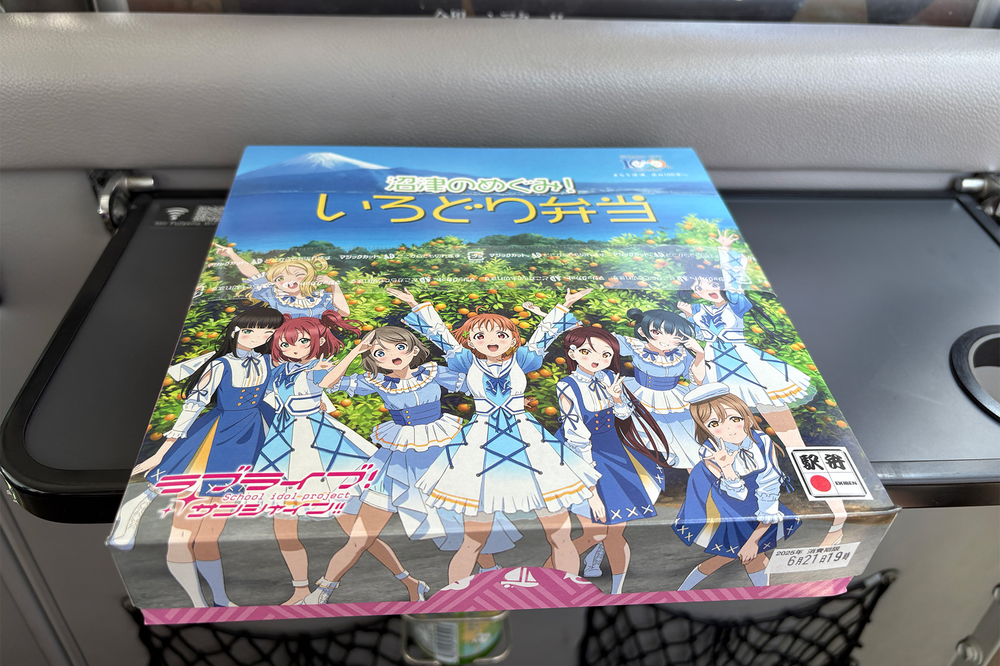

通常、桃中軒の弁当の注文は、本社工場にある外商部に行うよう案内されているのだが、電話するとどういうわけか「その弁当については沼津駅の売店から注文して貰う必要があります」と言われ、そのように対応した。

そもそもこの弁当は沼津駅でしか販売されておらず、土日祝しか置かれていないなど、おそらく桃中軒の内部でも特殊な立ち位置にいるのだろう。

受け取りに関しても、通常の大口注文では行ってくれる配達には対応していないとのことなので、駅南口の売店で直接受け取ることになった。売店の方の対応も親切で、売店は10時開店である一方で、我々の出発時間も10時だったため、弁当を待っての出発となる可能性もあったのだが、工場からの到着後すぐに引き渡していただくなど、色々と融通を効かせてくださった。また、何度か電話することがあったのだが、どなたが電話に出ても「21日にラブライブ！の弁当を20個注文している…」というと、「ああ！」と言ってくれたので、その後の話もスムーズだった（特殊すぎる客なのでわかりやすかったのだと思うが）。

### LED行先表示器風のボード

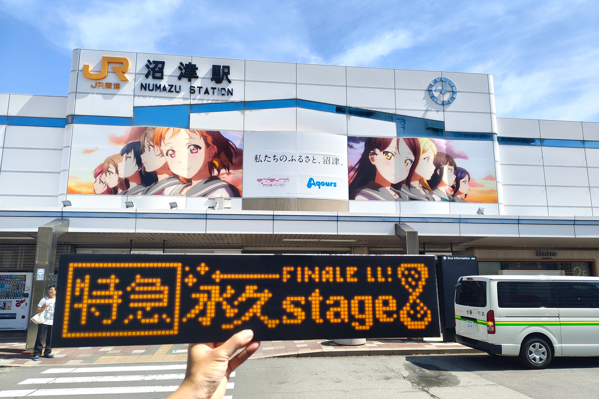

盛り上げのためというか、雰囲気作りとして、LED行先表示器風のボードを作った。

最初は Illustrator でそれっぽいものを作ろうと思ったのだが、LED行先表示器はいわゆるドット絵なので、 Illustrator の分野ではないかもしれないと思い、 AI と相談しながら、ブラウザで動くドット絵用のツールを作ることにした。

- [windyakin/direction-led-simulator](https://github.com/windyakin/direction-led-simulator)
- https://windyakin.github.io/direction-led-simulator/

なるべく本来のバスについている行先表示器と雰囲気を合わせるために、バスの写真からマトリックスのサイズをなんとなく揃えたり、単純な文字ではなく永久stageのロゴを参考にするなどした。砂時計のイラストの中のドットは「9つ」にするなど、細かいこだわりポイントなどもある。

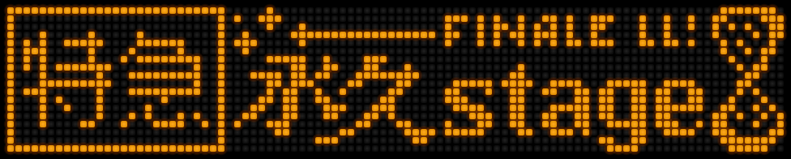

これをコンビニで印刷し、余っていたスチレンボードにスプレーのりで貼り付けて完成。沼津に来て5年、エントロピーが増え続けた結果、すべてが自宅にある。

運行当日にこれを持っていったところ、結構喜ばれ、いろいろな人が写真を撮ってくれた。撮影会をしていると、運転手の人に「バスに貼り付けますか？」と言われ、停車中のバスにマスキングテープで貼り付けて撮影させてもらった。というかA3というサイズに縛られて作った割に、サイズぴったりすぎてワロタ。

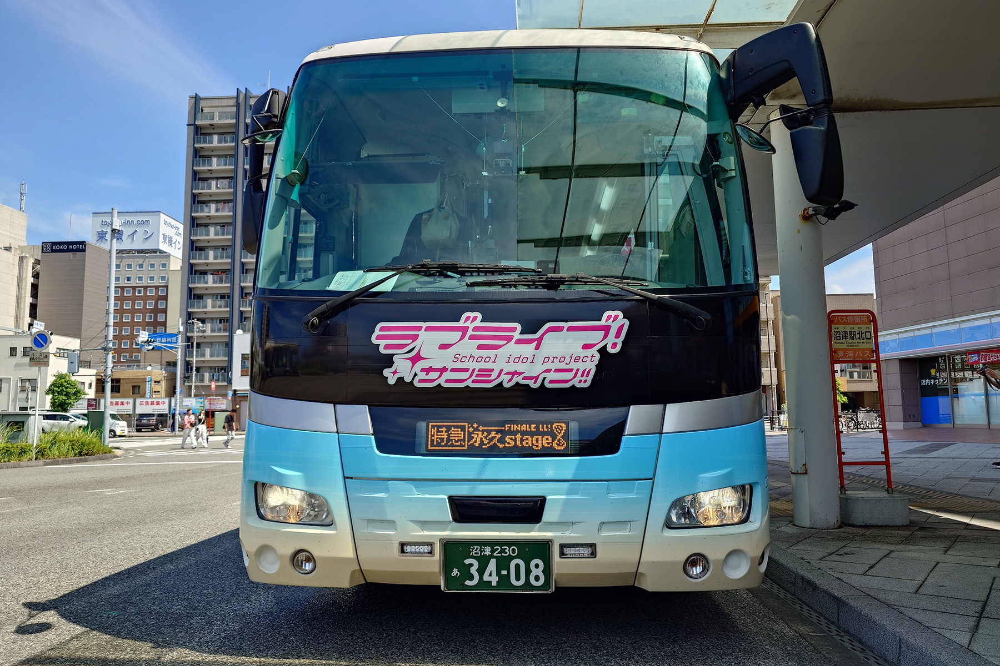

### 出発、沼津と内浦を心に刻む

当日朝もなんとか大きなトラブルもなく、バスは沼津駅北口を出発する。

バスは一路、作品に登場する「浦の星女学院」のモデルとなった、長井崎中学校のある内浦へ向かった。途中、バスをみかけた子どもや、あげつち商店街にある商店の店主の方が気づいて手を降ってくれるなど、バスは終始和やかな雰囲気となった。

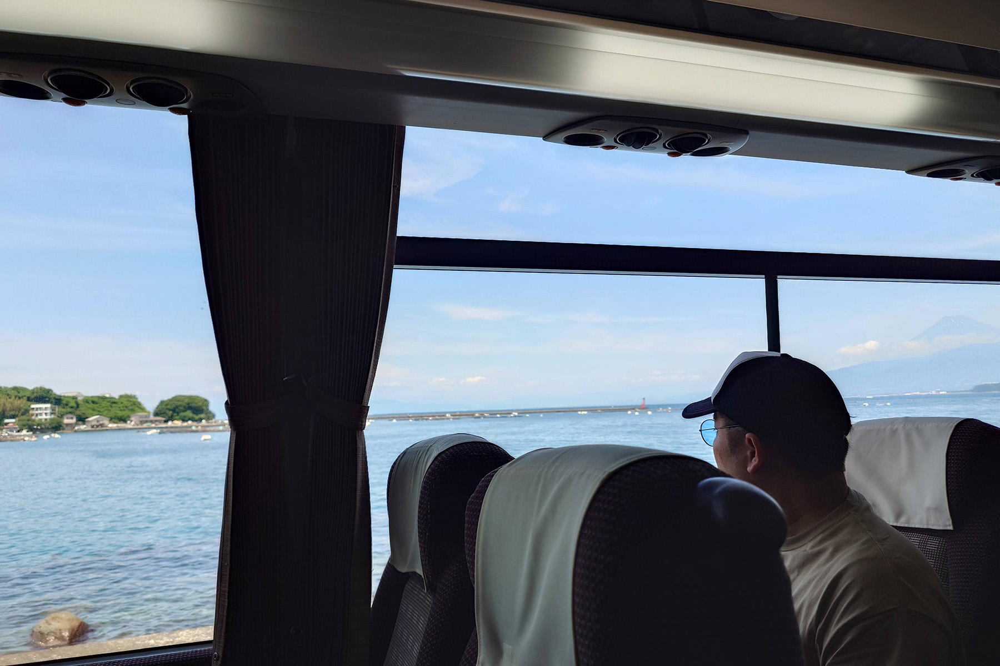

天候にも恵まれ、夏には珍しく、ちょうど富士山も顔を出してくれており、まさに作品で描かれた沼津や内浦を体感できる行程となり、非常によかった。

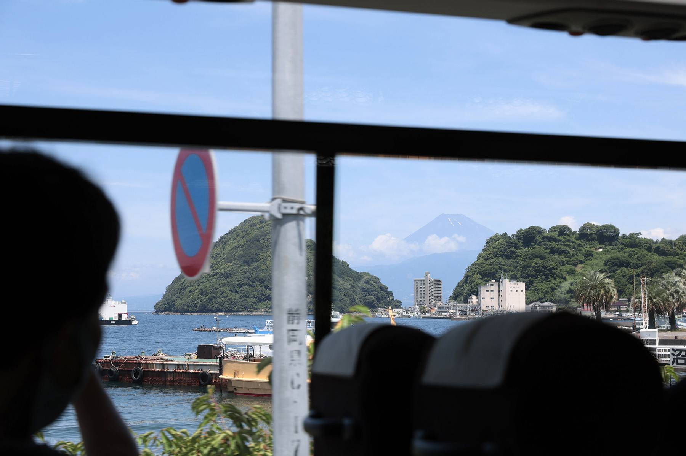

### 下車

そのまま、バスは伊豆縦貫道、東名高速をひた走り、会場となるベルーナドームへと向かった。特に大きな渋滞もなく、クーラーの効いた車内でそれぞれが思い思いに過ごす快適な旅路となった。

しかしながら、本運行における最大の難点はこれからである。それは下車場所の確保だった。

過去に参加した 6th SUNNY STAGE のときに会場周辺を歩いた際、接続道路の路側帯にパイロンが立てられていた記憶があり、事前に目星をつけていたバスが退避できる箇所も塞がれている可能性があった。そのため、下車場所の選定には入念な打ち合わせを行い、降りられなかった場合には、所沢駅のバスロータリーを利用するというプランBも用意していた。

会場前に着くとやはり路側帯にはパイロンが置かれており、予定していた場所での下車は無理だったのだが、運転手さんの機転によって、運良く近くに停車ぐらいならできそうな場所を見つけ、そこで乗客全員速やかに下車することにした。

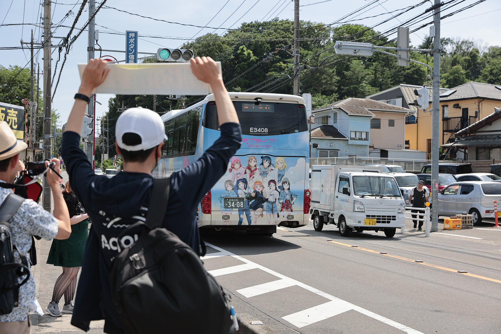

下車するときに、運転手さんが「あと何周すればいいですか？」と言ってくれたので、（何周でもするの！？）と思いつつ「追加でもう1周してきてください」と伝え、我々もベルーナドームの前を通るバスの写真を納めることができた。そもそもこの運行自体がオタクのわがままに付き合っていただいているというだけにもかかわらず、運転手さんのサービス精神も豊富だった。大変ありがたい。

結果、予定していた15時より大幅に早い14時には会場に無事到着でき、会場入りをXでポストした。

> 【特急】永久stage 🚍️  
> 本日、有志一同で富士急シティバス様所有のAqoursラッピングバスをお借りして、沼津駅から出発し、無事ベルーナドームに到着いたしました🚌  
> 本企画にご協力いただいた皆様、ありがとうございました。  
> #Aqours_finale_Day1 #特急永久stage
>
> <cite>https://x.com/umineco_nmz/status/1936310571143663924</cite>

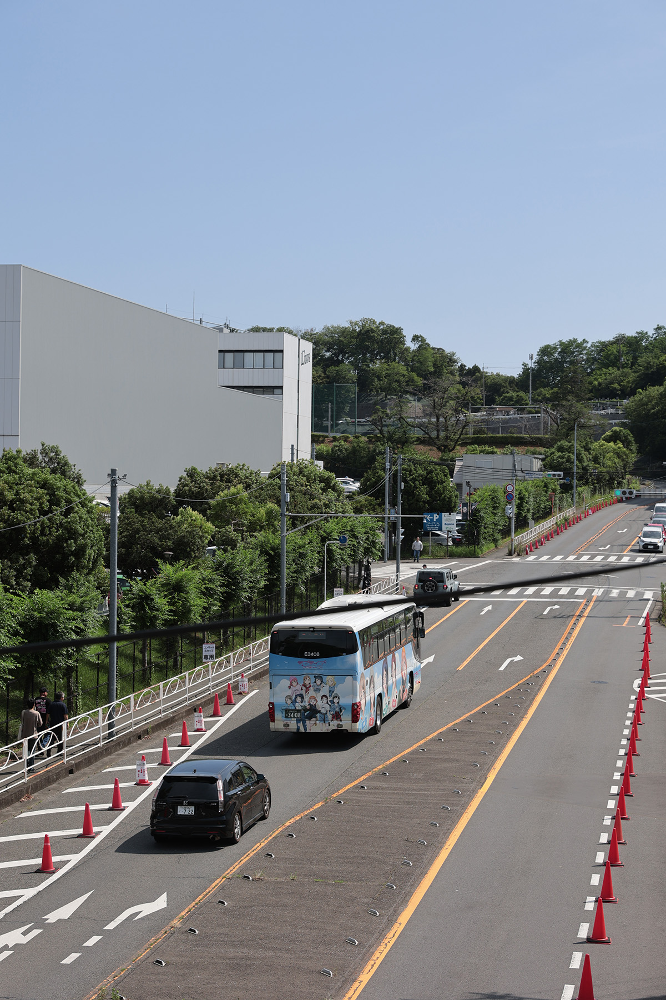

### 感想

今回の Finale ライブでは、オープニングで沼津駅やあげつち商店街、内浦の景色が描かれており、まさに今回のバスでやってきた経路と同じものを見ることができており、ライブの没入度を高めることができて本当にいい体験だった。

あと、開演まで X でいろいろな人が目撃したというポストを見つけては、ニヤニヤしていた。すみません。

そして、普通に沼津からベルーナドームに行く移動手段としては、乗り換え無しで行けることや、移動時間もそこまで遅くもないので、一番快適な移動手段ではないかと思う。

次の約束はないものの、またこういったことをする機会が生まれることを願ってやまない。

最後に今回の運行の手配をしてくださった、富士急トラベル様、及びバスを貸してくださった富士急シティバス様、発案・見積もりなど事務処理をしてくださった ぷらむ さん、ご乗車いただいたすべての皆様に感謝します。ありがとうございました。
