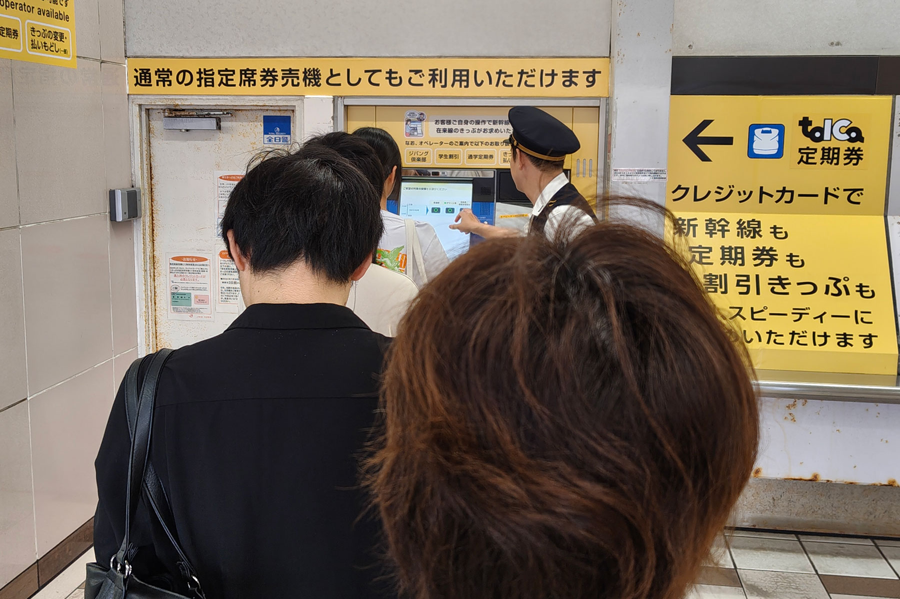
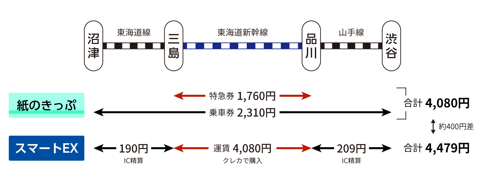
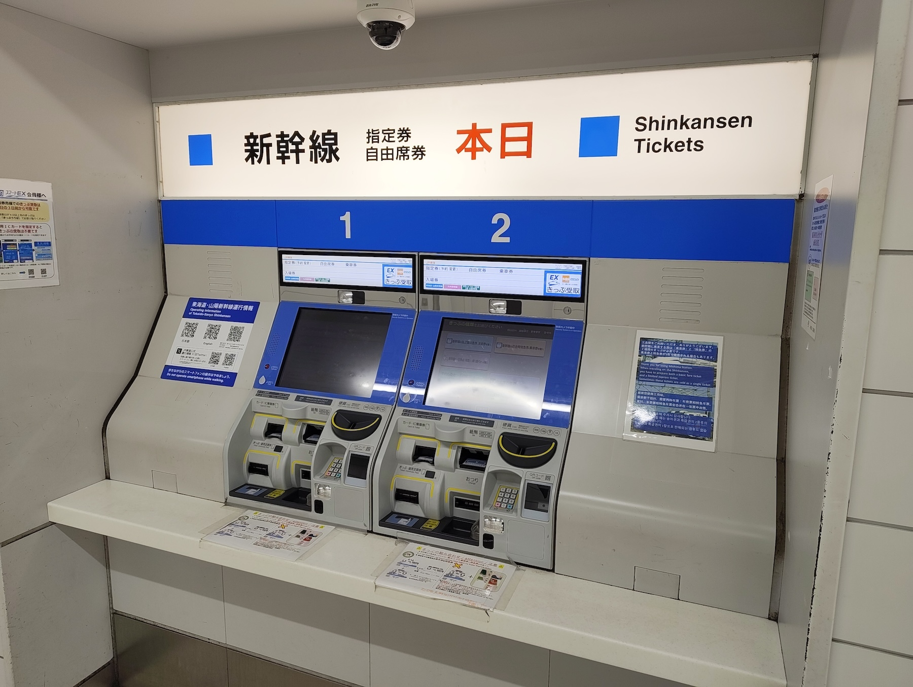
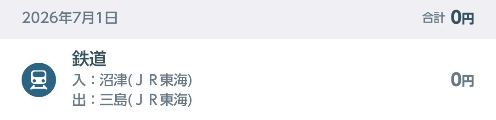
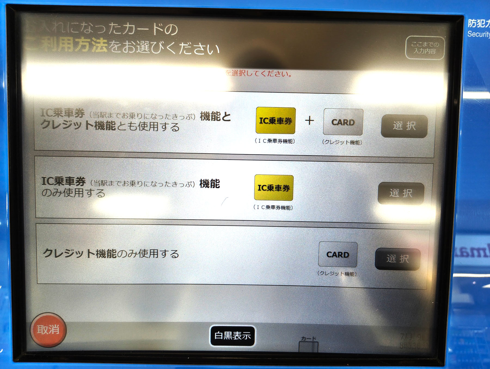
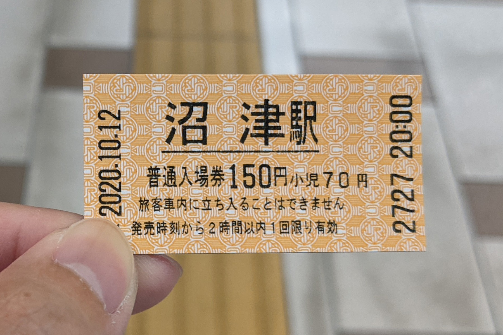
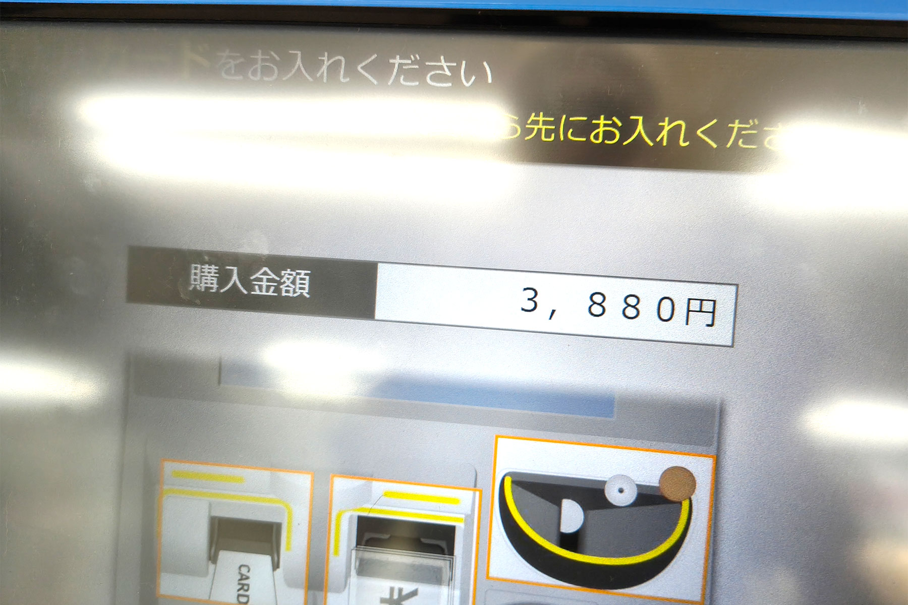
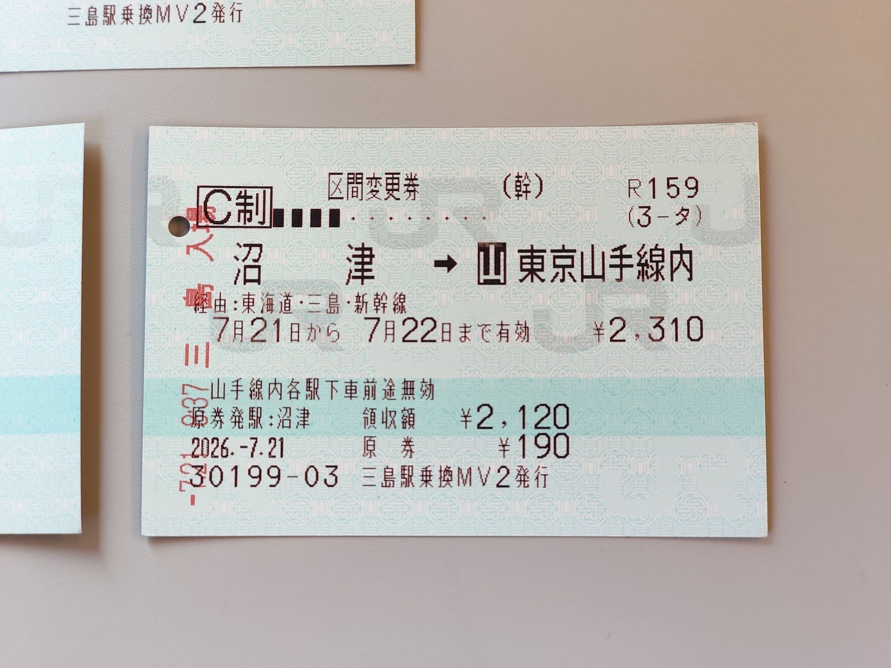
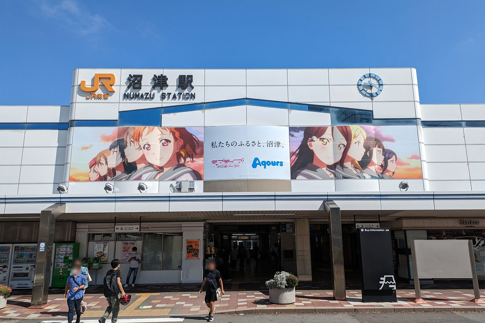

### 最初に結論

沼津駅から三島駅までICカード（モバイルSuica不可）または近距離きっぷで乗車し、新幹線乗換口にある指定席券売機を使うとよい。

### 沼津駅の指定席券売機に行列ができている

沼津駅は、JR東日本との境界となっている熱海駅にも近く、[交通系ICでは熱海から先に乗り継げない問題](https://toica.jr-central.co.jp/howto/sharing/index.html)や、三島駅から新幹線に乗り換えて東京方面に行く人も多いこともあって、もともと遠距離の乗車券を購入する需要が高い駅である。

それにもかかわらず、指定席券売機は北口と南口にそれぞれ1台ずつしか設置されておらず、2026年4月からは有人窓口も2つから1つに減らされている（代わりに1台しかない自動券売機を[サポートつき指定席券売機](https://railway.jr-central.co.jp/support-atvm/)に変更）。

その結果、ピーク時には駅できっぷを買い求める人によって、有人窓口と指定席券売機の両方に長蛇の列が発生しており、実際「きっぷが買えずに乗りたい列車に乗り遅れた」などといった報告もみられる。

そもそも、沼津駅の乗降者数は、[令和6年度に行われた静岡県の調査](https://toukei.pref.shizuoka.jp/toukeikikakuhan/page/nenkan/tyouki_nenkan20190401.html)で静岡・浜松・三島に次いで4位と、静岡県内の<b>新幹線が止まらない駅としては最上位</b>であり、3位の三島駅と4位の沼津駅の差は1.5倍しかない。にもかかわらず指定席券売機の数は三島駅が北口だけで8台配置されているのに対し、沼津駅は南北合わせてもたった2台となっている。

冒頭にも述べた通り、もともと沼津駅はその立地から窓口や指定席券売機の需要が高いということは、JR東海も把握していないことはないだろう。それにもかかわらず有人窓口を減らし、指定席券売機は増設しないままとした采配は、意地悪な言い方をすれば「コストカットによるサービスの低下」と受け取らざるを得ない。

### いま我々はどうするべきか

この状態の改善には、指定席券売機の増設を利用者だけでなく行政とも一体となり、様々なチャンネルを通してJR東海に要望を出し続けることが必要とされるが、一般に鉄道会社においてコストがかかることが見込まれる改善に対しての腰は重いものであり、かなりの時間を要するか、そもそも改善されないといったことも見込まれる。そこで「今」我々が損をしないために取れる手段がないかを考えるべきである。

### スマートEXでの乗り継ぎは損をする

まず駅でも案内されている対応としては、「[スマートEX](https://smart-ex.jp/top.php)」を使うという方法である。かねてから、JR東海ではスマートフォンを使って新幹線のきっぷを買うことができるサービスを運営しており、このサービスを使うことによって、沼津駅から東京まですべての改札をICカードで通過することが可能になるため、沼津駅で乗車券を購入する必要がなくなる。

しかしながら、スマートEXには、**新幹線駅間の運賃と、そこから乗り継いだ在来線の運賃は別になる**という問題がある。これの何が問題なのかわからない人のために説明しよう。

例えば、沼津駅から山手線の渋谷駅まで新幹線の自由席を乗り継いで行くとする。これを紙のきっぷで購入すれば、乗車券が2,310円と特急券が1,760円の【合計 4,080円】で移動できる。

しかし、スマートEXを利用した場合は、**三島駅から品川駅までの移動のみに 4,080円 を支払う**という点に注意が必要である。

そのため、今回想定しているパターン（沼津⇔渋谷）では、沼津から三島までと、品川から渋谷の運賃はそれぞれ別料金となる。一見、ICカード1枚でシームレスに乗り降りしているように見えるが、乗車券をバラバラに購入していることになり、沼津駅から三島駅の運賃190円、品川駅から渋谷駅の運賃209円、これらを**別途ICカードの残高から支払う**ことになっている。

結果、沼津駅から渋谷駅までスマートEXを使って乗り継ぐと【合計 4,479円】となり、紙のきっぷを購入した人と、スマートEXで購入した人が、まったく同じ列車に乗って移動できたとしても、片道で約400円の差額が発生してしまう。

端的に言えば、スマートEXを使うと「損をする」状態になっているため、沼津駅から乗車し、東京・品川以外の駅で降車したい場合においては、紙のきっぷでの移動のほうが望ましいのである。

### ICカード乗車＋乗り換え用指定席券売機 という解

しかしながら、冒頭述べた通り沼津駅の指定席券売機は行列ができており不便である。では、どうするべきか。実はその答えは[JR東海のウェブサイト](https://toica.jr-central.co.jp/howto/sharing/index.html)に載っている。

このページの最下部に書いてある内容を引用する。

<figure class="blockquote-cite">
<blockquote cite="https://toica.jr-central.co.jp/howto/sharing/index.html">

在来線の駅からTOICAで入場し、新幹線のきっぷをお持ちでない場合は、乗換口の指定席券売機またはきっぷうりばでお買い求めください。<strong>TOICAの入場情報を取り消し、在来線の乗車駅から目的の駅まで</strong>（中略）<strong>のきっぷをご購入いただけます</strong>。（後略）

</blockquote>
<figcaption>— <cite><a href="https://toica.jr-central.co.jp/howto/sharing/index.html">TOICA｜ご利用可能エリア（JR東海）</a></cite></figcaption>
</figure>

この文章の意するところを解読すると、ICカードで在来線駅から新幹線駅に移動した後に、新幹線乗換口にある指定席券売機を操作すれば、1枚の連続した乗車券と特急券を発券し、ICカードの残高はそのままになるという意味に受け取れる。

ここでポイントとなるのが、新幹線駅で**改札の外に出ないこと**である。

在来線から新幹線に乗り継ぎができる駅の乗換口には必ず指定席券売機が設置されている。赤い文字で「本日」と書かれているので、なんとなく目にしたことがある人も多いはずだ。

実は、乗車する駅で特急券や目的地までの乗車券を持っていなくても、この改札内にある指定席券売機を操作することで、新幹線に乗ることが可能なのである。

### IC乗車→乗り換え用指定席券売機 を実際にやってみると

実際に沼津駅でICカードで入場したのち、三島駅へ移動。そのまま乗換口にある指定席券売機を操作すると、最初に「ここまで乗ってきたきっぷかICカードを挿入してください」と案内された。指示された通りICカードを差し込んで操作を行うと、そのまま目的の駅までのきっぷ購入を行うことができた。

このとき購入したきっぷは、沼津→東京（山手線内）の乗車券と自由席特急券で4,080円と、沼津駅で紙のきっぷを買ったときと同じ値段であった。

念のためICカードの履歴をみたが、記録上は「沼津→三島 0円」となっており、入場記録が取り消されているというより、三島駅まで0円で移動したことになっていた。

また個人的に利用しているICカードが、クレカ機能付きのICカード（ビューカード）のため、指定席券売機で最初にICカードを差し込んでしまったら、支払いのためにそのカードのクレカ機能を利用できないのではないかという心配があった。しかし、これについても実際に行ったところ、最初にICカードとして差し込んだ際に、このカードをどの機能として使うかを選ぶ画面が出て来て、ICカードとして利用しても、そのままクレジットカードとしても同時に利用できたので問題なく購入することができた。

### モバイルSuicaには非対応なことに注意

三島駅の指定席券売機事情として注意が必要なのが、モバイルSuicaに非対応なことだ。世の中にはモバイルSuicaに対応した指定席券売機も存在するが、三島駅では2026年8月現在で非導入であり、これについては段階的に行われているであろう機器の入れ替えを待つ必要がある。

もし沼津駅からモバイルSuicaで入場してしまった際は、有人改札に申し出るか、沼津・三島間の運賃190円については諦めて一度在来線改札を出ることをおすすめする。

ただ、この悲劇は沼津駅で近距離きっぷを購入するという方法で回避することができる。

### 近距離きっぷでも新幹線に乗り継ぐことができる

もし沼津駅でモバイルSuicaしか持っていない場合や、現金のみで支払いたい場合は、沼津駅から三島駅までの近距離きっぷの購入をおすすめする。

近距離きっぷというのはいわゆるオレンジ色の小さな紙のきっぷのことで、最近ではモバイルSuicaの残高を使った購入もすることができる。また沼津駅には近距離券売機が3台ほどあるので、混雑はしていても、指定席券売機のように何分も行列で待たされることはないだろう。

最初に三島駅までの190円のきっぷの支払いをする必要があるが、三島駅の新幹線乗換口にある指定席券売機では、この190円を差し引いた金額が請求されるようになっており、スマートEXのような損をすることはない。

出てくるきっぷが通常の乗車券とは異なり、「区間変更券」というものになるのだが、普通に使う分には気にせず使うことができる。ただ、この券は通常の乗車券に比べて払い戻しに関する扱いがややこしいため、もし天候や路線の状態に不安がある場合には気をつける必要があるが、ここでそこまで取り扱うと終わらないため、「若干のリスクを伴う」ということだけ申し伝えておく。

### まとめ

本記事では、沼津駅の指定席券売機の行列を回避するために、三島駅の新幹線乗換口にある指定席券売機を活用する方法を紹介した。かねてより近距離きっぷやICカードを使って在来線駅から乗車し、新幹線駅に移動するという需要は存在しており、実際に御殿場線などのローカル線では近距離券売機や簡易IC改札しかない駅も存在するため、そういった駅からの新幹線への乗車に対応する仕組みとして整備されているものである。

ただし、これはあくまで対症療法的な手段であることを強調しておきたい。本来であれば、乗車駅で目的地までのきっぷを不自由なく購入できるべきであり、それができないこと自体が問題である。2026年4月の有人窓口の削減に端を発する指定席券売機の不足は、沼津駅の利用者数や遠距離きっぷの需要を考慮すれば明らかに不十分な体制であり、JR東海に対して指定席券売機の増設や窓口体制の改善を、利用者・行政が一体となって訴え続ける必要がある。

また、本記事で紹介した方法は新幹線を利用して東京方面へ向かう場合に限った対処法であることにも注意してほしい。在来線のみで熱海を経由して東京圏へ移動する場合には、この方法は使えない。在来線利用の場合は引き続き沼津駅の指定席券売機で乗車券を購入するか、降車駅で精算するほかないのが現状である。

